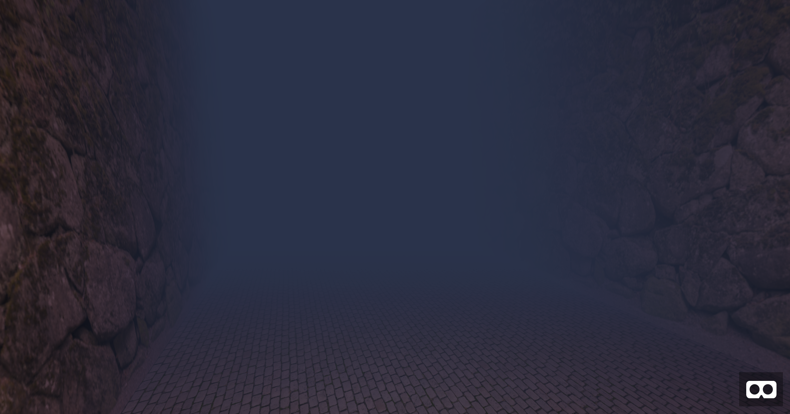
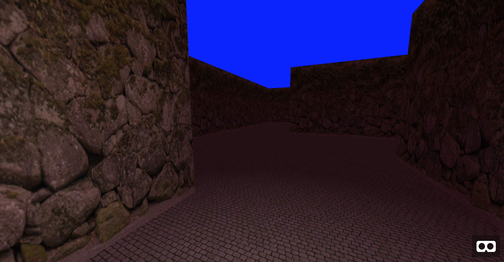
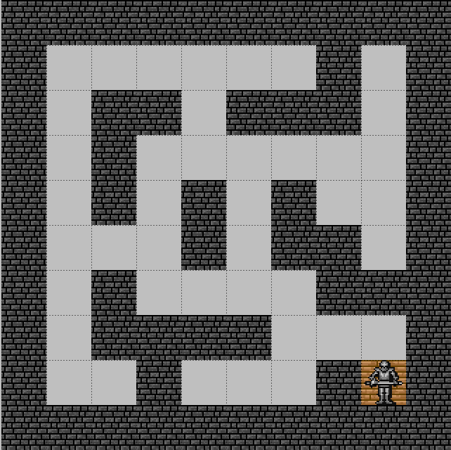

[Live Demo](https://shanehudson.net/tools/first-steps-in-vr/02-maze-map/index.html) | [Article on 24 Ways](https://24ways.org/2016/first-steps-in-vr/)

First Steps in VR
=================

This is the codebase that complements the [First Steps in VR article on 24 Ways]. It is written using [A-Frame] and [A-Frame-Extras], to demonstrate how to approach WebVR without the steep learning curve.

How To Run
----------

The code is kept as simple as possible, so no build scripts or anything. You will need to run a server or disable CORS though. If you don’t mind the walls and floors being solid colours then feel free to skip this step!

One way to do this is by using Python’s SimpleHTTPServer, but there are many alternative ways.

 Screenshots
------------

[First Steps in VR article on 24 Ways]: https://24ways.org/2016/first-steps-in-vr/ "First Steps in VR"
[A-Frame]: https://aframe.io/ "A-Frame"
[A-Frame-Extras]: https://github.com/donmccurdy/aframe-extras "A-Frame Extras"